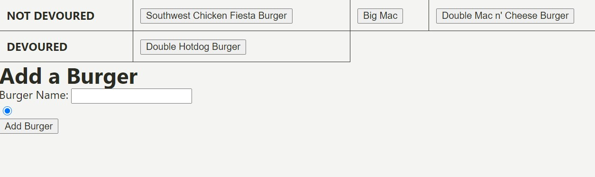

# EATDABURGA

### Overview

**EATDABURGA** is an app that allows users to enter names of burgers they'd like to eat, and then eat them! This is an exercise in MySQL, Node, Express, Handlebars, and a homemade ORM.

**EATDABURGA** has little to no styling - it's kept dry on purpose. Users are meant to have fun and create obscure burgers, devour them, and leave them for someone else to find.

### Usage

- Whenever a user submits a burger, the app displays the burger's name in a table under the heading "NOT DEVOURED", where the burger will wait to be devoured.

- The name of the burger is a button, and when clicked, the burger will move to the "DEVOURED" column.

- All burgers are stored in the database forever - whether devoured or not.

- That's it!

### [Use the app here](https://fast-cliffs-11572.herokuapp.com/)
